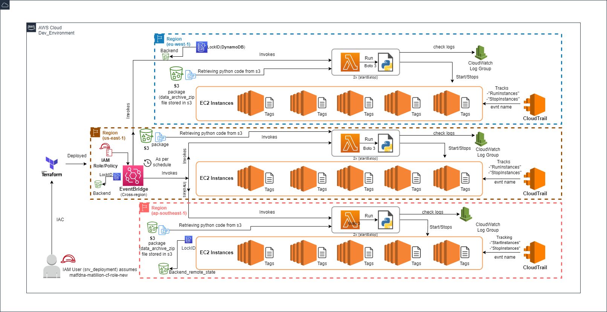

# How to Reduce the Costs of Running AWS EC2 Instances

Let's optimize the use of matillion servers and save some money.

# Introduction

It is painful to start and stop instances manually on a daily basis. 
It is also called the scheduler for AWS EC2 instance.
We create a Lambda function leavraging python boto3 with the CloudWatch rule and event which automatically starts or stops the instance based on the predefined time in the CloudWatch rule.

There are some Benefits on using scheduler on EC2:

Access the instance as per the working hours.
Reduce costs.
Stop instance from loading up on weekends.
The time limit for employees for working on the instance.

# Architecture

# Implementation

Currently, the implementation is only available in the following regions:

1. US East (N. Virginia) - us-east-1
2. Europe (Ireland) - eu-west-1
3. Asia Pacific (Singapore) - ap-southeast-1

If necessary, we can also make it global or add new regions.

# Solution

AWS Lambda Functions, AWS EventBridge, Python boto3 . Using this method, You can schedule the start and stop of your EC2 instances by using the tag below on the target EC2 instances.

key = Auto-Start-Stop

value = true

# Logic of the Python Code

Returning All EC2 instances(InstanceI) tagged with the tag Auto-Start-Stop will be started each working day from Monday to Friday at 8:00 am UTC Which is 9:00 (UTC+1)=Prague time (CET) 
and will stopped each working day from Monday to Friday evening at 6:00 pm UTC Which is 7:00 pm (UTC+1)=Prague time (CET) 

# Adjustment

We can adjust the schedule time if needed manually on the console or remotely by reploying the changes using terraform since we store the state in the s3 bucket.

Note: It is best practice to apply the changes using Terraform for consistency, as this will prevent a lot of confusion, inconsistency, and duplicate resources.

# Remediation

Remove manually the tag: "Auto-Start-Stop" on the target ec2 instances

# Deployment pre-requisites

Terraform CLI (1.0+) installed

IAM Role/IAM User with the necessary permissions. IAM User (srv_deployment) assuming our IAC admin IAM Role (matfdna-matillion-cf-role-new)

AWS CLI (2.0+) installed

# Deployment Steps

1. git clone https://stash.merck.com/scm/mdbt/extra-automation.git

2. change the directory => cd auto-start-stop

3. terraform init

4. terraform plan

5. terraform apply --auto-approve
